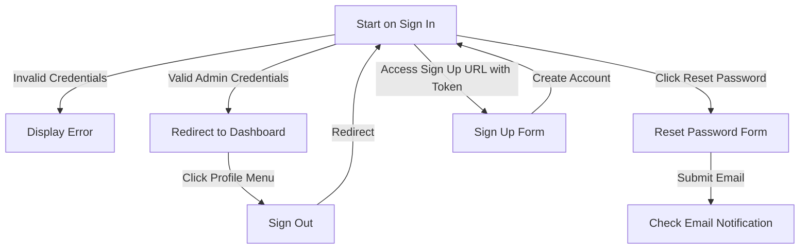
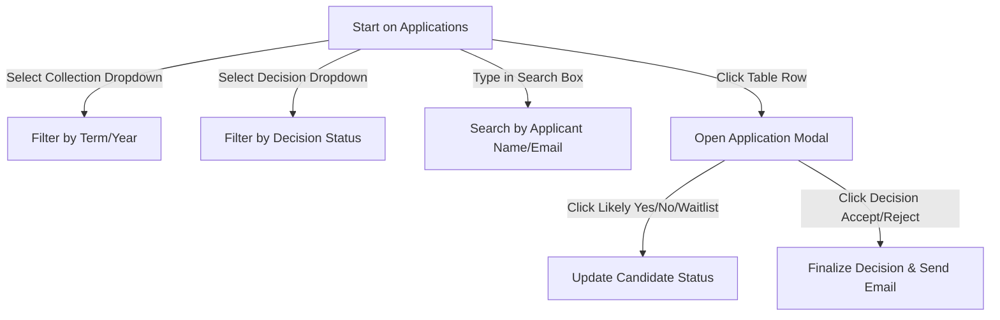

# Release Test Plan

This document details the manual and automated regression test suite to verify all core features of the gbSTEM Admin website before any production release. It is structured sequentially to facilitate direct translation into Cypress E2E tests.

If you want to watch Cypress execute this in your browser, you can start it with extra arguments like the following, where `--headed` makes it so it runs a visible browser and `--browser` selects a browser to run (this example is using Chromium, the open source version of Chrome that is often installed on Linux systems but you can also use `chrome` to run the official version of Google Chrome, or `firefox` to run Firefox). But as you'll see, it goes **very** fast and is hard to keep up with. You can use other arguments to have it add a video that you can playback at a slower speed. For example, `yarn cypress --browser=chromium --headed --video` will create a video of the test run in the `cypress/videos` directory. There are many [options you can use](https://docs.cypress.io/guides/references/command-line#cypress-open). See [this page](https://docs.cypress.io/guides/getting-started/opening-the-app) to get started with Cypress.

`yarn cypress --browser=chromium --headed`

However, remember that you can actually see what is happening on the screen in a way that Cypress isn't: it just keys off of HTML elements and CSS classes, so can miss major visual bugs. That means it is important for you to do a test run yourself, or at least carefully watch the Cypress test run. It is also important to use meaningful IDs and class names when we create our components and tests.

---

## 1. Setup and Pre-requisites

Follow these steps to establish a clean, predictable, local testing environment.

### A. Initialize Local Configuration

1. Copy `.env.example` to `.env.local` in the `admin` directory.
2. Ensure the emulator hosts are configured (uncommented) in `.env.local`:

   ```env
   FIRESTORE_EMULATOR_HOST="127.0.0.1:8080"
   FIREBASE_AUTH_EMULATOR_HOST="127.0.0.1:9099"
   STORAGE_EMULATOR_HOST="127.0.0.1:9199"
   ```

### B. Launch Firebase Emulator Suite

1. Start the Firebase Emulator suite:

   ```bash
   yarn emulators
   ```

### C. Seed Local Emulator Database

1. Populate the emulators with mock seed data by running:

   ```bash
   yarn seed
   ```

### D. Run the Development Server

1. Start the SvelteKit local server:

   ```bash
   yarn dev
   ```

   _Verify that the application is running at <http://localhost:5173> and you can log in._

---

## 2. Test Cases & E2E Validation Sequence

### Section A: Authentication and Basic Navigation



#### Test Case 1: Unauthenticated Redirect to Sign In

- **Description**: Ensure unauthenticated users accessing internal routes are redirected to the sign in page.
- **Steps**:
  1. Clear any active session by visiting `http://localhost:5173/signin` and clicking Sign Out if logged in.
  2. Attempt to navigate to `http://localhost:5173/dashboard`.
  3. Attempt to navigate to `http://localhost:5173/profile`.
- **Expected Results (Assertions)**:
  - Both attempts are blocked.
  - The URL is rewritten to `http://localhost:5173/signin`.
  - The browser displays the Sign In form.

#### Test Case 2: Unsuccessful Sign In

- **Description**: Verify that sign in fails when invalid credentials are provided.
- **Steps**:
  1. Navigate to `http://localhost:5173/signin`.
  2. Type `demo@gbstem.org` in the **Email** input.
  3. Type `wrongpassword` in the **Password** input.
  4. Click the **"Sign in"** button.
- **Expected Results (Assertions)**:
  - Sign in fails and does not redirect the user.
  - An alert notification showing the Firebase error code (e.g. `auth/invalid-credential` or `auth/wrong-password`) is displayed.

#### Test Case 3: Successful Sign In

- **Description**: Verify that a user can successfully sign in with correct credentials and is redirected to the Dashboard page.
- **Steps**:
  1. Navigate to `http://localhost:5173/`
  2. Type `demo@gbstem.org` in the **Email** input.
  3. Type `penguin` in the **Password** input.
  4. Click the **"Sign in"** button.
- **Expected Results (Assertions)**:
  - Initially redirects successfully to `http://localhost:5173/signin`.
  - Redirects successfully to `http://localhost:5173/dashboard`.
  - The page title/header displays `"Dashboard"`.
  - The authenticated navigation bar is visible, featuring links for **Tokens**, **Dashboard**, **Classes**, **Students**, **Interviews**, **Applications**, **Registrations**, **Student Feedback**, **Instructor Feedback**, and **Sub Requests Log**.
  - A profile menu icon button is displayed in the top-right corner.

#### Test Case 4: Password Reset Form

- **Description**: Verify the password reset flow can be triggered.
- **Steps**:
  1. Navigate to `http://localhost:5173/signin`.
  2. Click the **"Forgot password?"** link.
  3. Verify the URL is `http://localhost:5173/reset-password`.
  4. Enter `demo@gbstem.org` in the **Email** input.
  5. Click the **"Send email"** button.
- **Expected Results (Assertions)**:
  - A notification toast appears displaying: `"Password reset email was sent. Please check your inbox."`.
  - The email field is cleared.

TODO: Update this to check for the actual email being sent, not just the toast, and fully completing the password reset flow.

#### Test Case 5: Sign Up with Registration Token

- **Description**: Verify that a new account can be created using a valid registration token.
- **Steps**:
  1. Navigate to: `http://localhost:5173/signup?token=demo-admin-token`.
  2. Verify that the **Sign up** page loads and the token input is populated.
  3. Fill out the fields:
     - **First name**: `Test`
     - **Last name**: `User`
     - **Email**: `newadmin@gbstem.org`
     - **Password**: `password123`
     - **Confirm password**: `password123`
  4. Click the **"Sign up"** button.
- **Expected Results (Assertions)**:
  - Account creation succeeds and redirects the user to the Sign In page (`http://localhost:5173/signin`).
  - Attempting to sign up with mismatched passwords shows the validation error message `"Passwords do not match."` under the confirm password input.

---

### Section B: Dashboard and Navigation Layout

#### Test Case 6: Stats Verification and Action Actions

- **Description**: Verify the dashboard loads real-time emulator stats, and check clipboard interactions.
- **Steps**:
  1. While signed in as an Admin, click the **"Dashboard"** link in the navigation bar.
  2. Verify that the **Applications** card contains:
     - `32 total instructor applications created.`
     - `22 instructor apps submitted.`
     - `7 instructor apps decided.`
     - `33 students pre-registered.`
     - `33 pre-registrations started.`
     - `16 students enrolled.`
  3. Click the **"Copy Emails for Uncompleted Registrations"** button.
  4. Verify that clipboard contains the emails and a success toast notification appears: `"Emails copied to clipboard!"`.
  5. Click the **"Copy Emails for Uncompleted Applications"** button.
  6. Verify that clipboard contains the emails and a success toast notification appears: `"Emails copied to clipboard!"`.
  7. Click the **"View Announcements"** link under the Dashboard title.
- **Expected Results (Assertions)**:
  - The Dashboard page renders the `<h1>` title `"Dashboard"` at the top taking up full window width.
  - A link `"View Announcements"` is visible directly under the title.
  - After step 7, the browser successfully routes to `http://localhost:5173/announcements`.
  - The clipboard copies and success toast alerts function correctly.

#### Test Case 7: Classes Today Alerts and Reminders

- **Description**: Verify that classes held today are rendered with status-based colors and instructor reminders can be sent.
- **Steps**:
  1. Note: This requires the current local time matching the seed date, or emulator overrides.
  2. Verify that class sessions scheduled for today appear in the list under **Classes Today**.
  3. Verify that upcoming classes appear in a **blue** background (`.bg-blue-100`), missed classes in a **red** background (`.bg-red-100`), feedback incomplete in a **yellow** background (`.bg-yellow-100`), and completed classes in a **green** background (`.bg-green-100`).
  4. Click the **"Send Instructor Reminder"** button on one of the items.
  5. Verify that the reminder email action triggers (in the console or mock email handler).

---

### Section C: Announcements Page

#### Test Case 8: View Announcements and Control Pagination

- **Description**: Verify that announcements load and pagination limits can be selected.
- **Steps**:
  1. Click the profile/navigation menu or go to `http://localhost:5173/announcements`.
  2. Verify the page header displays `"Announcements"`.
  3. Locate the **Per Page** dropdown selector (`#Per Page` / select element).
  4. Change the value to **"50"**.
  5. Scroll to the bottom and verify pagination buttons (**Previous** / **Next**) behave correctly.
- **Expected Results (Assertions)**:
  - Announcements are listed inside a table containing columns for Date, Title, and Content.
  - The URL updates parameters to `?limit=50&page=1` when "50" is chosen.
  - The **Previous** button is hidden on page 1, and the **Next** button is visible if there are more announcements than the limit.

---

### Section D: Instructor Applications Management



#### Test Case 9: Filter, Search, and Download Applications Table

- **Description**: Test search box, collection filters, decision filters, and data exports.
- **Steps**:
  1. Click the **"Applications"** link in the navigation bar (navigates to `/applications`).
  2. In the **Search Box**, type `David`.
  3. Verify the table filters down to show only `David Miller`.
  4. Clear the search box.
  5. Locate the **Collection** dropdown (default is the latest collection). Select the previous collection (e.g., `"Fall 2025"`).
  6. Verify the table updates.
  7. Locate the **Decision** dropdown. Select `"Undecided"`.
  8. Verify the table displays only undecided applicants.
  9. Click the **"Download"** button.
- **Expected Results (Assertions)**:
  - Table columns display: `Likely decision`, `Notes`, `Submitted`, `Decision`, `Interview scheduled`, `Name`, `Email`, `School`, `Year`, `Courses`, `Timeslots`, `Taught before`.
  - The CSV download link contains correct headers: `ID,Submitted,Decision,Likely Decision,Notes,First Name,Last Name,Email,School,Graduation Year,Courses,Time Slots,Taught Before,In-person`.

#### Test Case 10: Bulk Application Decisions

- **Description**: Select multiple applicants and execute bulk status mutations.
- **Steps**:
  1. Navigate to `/applications`.
  2. Select the header checkbox `check-all`.
  3. Verify all visible row checkboxes are checked, and the bulk actions bar appears at the top.
  4. Uncheck `check-all`.
  5. Individually check two row checkboxes (e.g. `check-0` and `check-1`).
  6. Verify the bulk action buttons display:
     - `Interview 2 applicants` (blue)
     - `Accept 2 applicants` (green)
     - `Substitute 2 applicants` (purple)
     - `Waitlist 2 applicants` (yellow)
     - `Reject 2 applicants` (red)
  7. Click the **"Close"** button on the bulk actions bar.
  8. Verify the selection is cleared and the bulk actions bar disappears.

#### Test Case 11: Application Details Modal, Editing Details, and Decision Updates

- **Description**: Open a single application modal, edit fields using the application details form, cancel changes, save changes, and update decisions.
- **Steps**:
  1. Click on the row for `David Miller` in the table.
  2. Verify that the **Application** details modal opens.
  3. Click **"Close Interview Form"** (green button) to hide the interview evaluation guide card and reveal the **"Edit"** button.
  4. Click the **"Edit"** button.
  5. Verify that the form inputs inside the **Application Details** card become editable (such as Phone number, Date of birth, School, etc.).
  6. In the **Phone number** input, change the value to `123-456-7890`.
  7. Click the **"Cancel changes"** button.
  8. Verify that the inputs become read-only and the phone number reverts to its original value.
  9. Click the **"Edit"** button again.
  10. In the **Phone number** input, change the value to `123-456-7890`.
  11. Click the **"Save changes"** button.
  12. Verify the notification toast says `"Changes were saved successfully."` and the inputs become read-only with the new phone number persisted.
  13. Click the **"Show Interview Form"** button (green button) to restore the interview guide panel.
  14. In the modal, locate the sticky header buttons: **Likely Yes**, **Likely Waitlist**, **Likely No**, **Clear Likely Decision**, **Interview**, **Accept**, **Substitute**, **Waitlist**, **Reject**.
  15. Click **"Likely Yes"**.
  16. Click **"Close"** to close the modal.
  17. Verify the table row updates to show the green check icon for `Likely Yes`.
  18. Re-open the details modal for `David Miller`.
  19. Click the **"Accept"** button.
  20. Click **"OK"** on the browser confirmation popup.
- **Expected Results (Assertions)**:
  - Clicking "Save changes" triggers a write to Firestore and disables form editing upon completion.
  - Clicking "Cancel changes" restores original document values.
  - Clicking "Accept" triggers a POST request to `/api/decision` to send the acceptance email.
  - The applicant's status updates in the database and renders the accepted icon in the table.

#### Test Case 11b: Instructor Interview Guide and Evaluation Form

- **Description**: Open an application modal and fill out the interviewer's rubric, ratings, and feedback notes.
- **Steps**:
  1. Click on the row for `David Miller` in the table to open the details modal.
  2. Click **"Show Interview Form"** if the Interview Guide & Evaluation Form is not already visible.
  3. Locate the **Interview Guide & Evaluation Form** card.
  4. Fill out the evaluation form fields:
     - **Interview Date**: Set a future datetime (e.g. `2026-06-15T15:00`).
     - **Interviewer**: Enter `Jane Doe`.
     - **Attendance**: Select `attended` from the dropdown.
     - **Friendliness (0-5 scale)**: Enter `4`.
     - **Conversation Notes**: Enter `Very polite, comfortable speaking to kids.`.
     - **What courses does the candidate want to teach?**: Enter `Python 1, Scratch`.
     - **Clarity of explanations (0-5 scale)**: Enter `4`.
     - **Engagement with audience (0-5 scale)**: Enter `3`.
     - **Pace of mock lesson (0-5 scale)**: Enter `4`.
     - **Overall quality (0-5 scale)**: Enter `4`.
     - **Mock lesson notes**: Enter `Mock lesson on lists was well structured. Pacing was a bit fast but clear.`.
     - **Tech or other issues**: Enter `None. Fast connection.`.
     - **Availability notes**: Enter `Available Saturdays and weekdays after 4pm.`.
     - **Recommendation summary**: Enter `Strong candidate, recommends for Scratch 1.`.
  5. Click the green **"Save Notes"** button at the bottom of the form.
  6. Verify the notification toast says `"Notes updated successfully."`.
  7. Click **"Close"** to dismiss the modal.
  8. Re-open the details modal for `David Miller`.
  9. Click **"Show Interview Form"** if needed and verify that all inputted fields (ratings, notes, date, interviewer, attendance) are correctly loaded and displayed.
- **Expected Results (Assertions)**:
  - Saving the interview notes writes a document to the latest decisions collection (merging fields).
  - The success toast is triggered.
  - Re-opening the modal retrieves and populates the saved interview values from Firestore.

---

### Section E: Classes Directory

#### Test Case 12: Classes Search, Filters, and Email Export

- **Description**: Verify searching and exporting classes data.
- **Steps**:
  1. Click the **"Classes"** link in the navigation bar (navigates to `/classes`).
  2. Select the **Course** filter dropdown and choose `"Python 1"`.
  3. Verify that only `"Python 1"` classes are shown.
  4. Click the **"Copy Emails"** button.
  5. Verify that clipboard contains all class instructors' emails and a toast confirmation is shown.
  6. Click the **"Download"** button.
- **Expected Results (Assertions)**:
  - Table columns display: `Instructor Name`, `Instructor Email`, `Course`, `Meeting Link`, `Class Time`, `Number of students`, `Classes Missed`, `Classes Missing Feedback`.
  - The exported CSV has matching data.

#### Test Case 13: Class Details Modal Actions

- **Description**: Edit class details, view class lists, and trigger student/instructor reminders.
- **Steps**:
  1. Click on the row for `"Python 1"` taught by `Demo Instructor`.
  2. Verify the **Class Details** modal opens.
  3. Verify the **Class List** section displays a table of enrolled students with columns: `Student Name`, `Email`, `Secondary Email`, `Phone`, `Grade`, `School`.
  4. Click **"Copy"** next to Class List to copy all students' and secondary emails.
  5. Click the **"Send Reminder To All Students"** button.
  6. Click the **"Send Instructor Reminder"** button.
  7. Click the **"Edit"** button in the modal header.
  8. Change the **Class capacity** value.
  9. Click the **"Save changes"** button.
- **Expected Results (Assertions)**:
  - Form fields become editable when "Edit" is clicked.
  - Saving updates the database document and shows the toast notification: `"Changes were saved successfully."`.

---

### Section F: Students Directory

#### Test Case 14: Students Search, Filtering, and Enrolling/Dropping Classes

- **Description**: Manage student records and class enrollment.
- **Steps**:
  1. Click the **"Students"** link in the navigation bar (navigates to `/students`).
  2. Search for `Charlie`.
  3. Click the row for `Charlie Brown`.
  4. Verify the **Student Attendance and Information** modal opens.
  5. Locate the **Select a class** dropdown in the "Add Class" section. Select `"Python 1 taught by Demo Instructor..."`.
  6. Click the green **"Add Class"** button.
  7. Verify that Charlie Brown is added to the class, and a POST request to `/api/enroll` is triggered.
  8. Locate the **Select a class** dropdown in the "Drop Class" section. Select `"Python 1 taught by Demo Instructor..."`.
  9. Click the red **"Drop Class"** button.
  10. Verify that the class is dropped successfully.
- **Expected Results (Assertions)**:
  - Adding/dropping classes triggers toast alerts confirming success.
  - The enrolled courses update in the student information table.

---

### Section G: Pre-Registrations Directory

#### Test Case 15: Filter, Search, and Edit Pre-Registrations

- **Description**: Verify registrations search, collection/status filters, CSV downloads, age limit bypass toggles, and detail edits.
- **Steps**:
  1. Click the **"Registrations"** link in the navigation bar.
  2. Verify that the URL changes to `http://localhost:5173/registrations`.
  3. Type `Charlie` in the search box.
  4. Verify that only registrations matching `Charlie` (e.g., `Charlie Brown`) are displayed in the table.
  5. Select a status filter (e.g., `"submitted"` or `"enrolled"`) from the **Status** dropdown.
  6. Verify that the table updates to display registrations matching both the name query and selected status.
  7. Select a collection (e.g., the latest collection) from the **Collection** dropdown.
  8. Verify that the registrations list updates to load records from the selected collection.
  9. Click the **"Download"** button to trigger the CSV download.
  10. In the **Bypass Age Limits?** column on `Charlie Brown`'s row, check the checkbox.
  11. Verify that the database document updates the `'agreements.bypassAgeLimits'` field immediately.
  12. Click on the row for `Charlie Brown` to open the **Registration** details modal.
  13. Click **"Edit"** on the sticky header.
  14. In the form, change the **Student Grade** from `"4"` to `"5"`.
  15. Click the **"Save changes"** button.
- **Expected Results (Assertions)**:
  - The page displays all controls, and search/filters narrow down registration rows correctly.
  - The downloaded CSV contains correct headers: `id,studentFirstName,studentLastName,parentFirstName,parentLastName,email,secondaryEmail,school,grade,csCourse,engineeringCourse,mathCourse,scienceCourse,inPerson`.
  - Toggling bypass immediately syncs changes to Firestore.
  - Saving form edits updates the row and displays the success toast: `"Changes were saved successfully."`.

---

### Section H: Interview Timeslots Configuration

#### Test Case 16: View, Create, and Manage Interview Slots

- **Description**: Create new slots, assign applicants, and edit slots.
- **Steps**:
  1. Click the **"Interviews"** link in the navigation bar (navigates to `/interviews`).
  2. Verify the **Interview Time Requests** card is visible.
  3. In the **Add A Time Slot** card:
     - Enter a date in the future in the **Set Date** field.
     - Type a Zoom link in the **Interview Meeting Link** input.
     - Select `David Miller` from the **Assign Interviewee** dropdown.
     - Click **"Confirm Timeslot"**.
     - Verify browser confirmation and click **"OK"**.
  4. Verify that the slot is created and appears in the list below.
  5. Find the newly created slot, click **"Edit"**.
  6. Modify the date or meeting link, then click **"Save"**.
  7. Click **"Edit"** again, then click **"Delete"** to remove the slot.
- **Expected Results (Assertions)**:
  - Creating a slot with an assigned interviewee triggers a POST request to `/api/assignInterview` to email the candidate.
  - Deleting the timeslot removes it from the list.

---

### Section I: Feedback Views (Student & Instructor)

#### Test Case 17: Audit Student Feedback

- **Description**: Verify that the student feedback page loads properly, navigation URL is correct, and that search, filtering, and CSV download functions work correctly.
- **Steps**:
  1. Click **"Student Feedback"** in the navigation bar.
  2. Verify that the URL changes to `http://localhost:5173/student-feedback`.
  3. Verify that the table columns are: `Student Name`, `Course`, `Instructor Name`, `Date`, `Feedback`, `Rating`.
  4. Type a student name in the search box.
  5. Verify that only feedback matching the student name is displayed in the table.
  6. Select a specific course from the course filter dropdown.
  7. Verify that the table displays only feedback matching both the search query and the selected course.
  8. Click the **"Download"** button to trigger the CSV download.
- **Expected Results (Assertions)**:
  - Navigation successfully opens `http://localhost:5173/student-feedback`.
  - Search box and course filters correctly narrow down the data table rows.
  - The downloaded CSV contains the filtered data with correct headers: `id,studentName,course,instructorName,date,feedback,rating`.

#### Test Case 18: Audit Instructor Feedback and View Details

- **Description**: Verify that the instructor feedback page loads properly, search/filtering options narrow down the results, details modal opens/closes, and CSV download works.
- **Steps**:
  1. Click **"Instructor Feedback"** in the navigation bar.
  2. Verify that the URL changes to `http://localhost:5173/instructor-feedback`.
  3. Verify that the table columns are: `Instructor Name`, `Course`, `Class Number`, `Date`, `Attendance Percent`, `Feedback`.
  4. Type an instructor name in the search box.
  5. Verify that only feedback matching the instructor name is displayed.
  6. Select a specific course from the course filter dropdown.
  7. Verify that the table displays only feedback matching both the search query and the selected course.
  8. Click on an instructor feedback row to open the **Class Feedback Details** dialog modal.
  9. Verify that the modal displays the instructor's name, class number, feedback, and student attendance list.
  10. Click the red **"Close"** button (or the "x" button in the top-right) to close the modal.
  11. Click the **"Download"** button to trigger the CSV download.
- **Expected Results (Assertions)**:
  - Navigation successfully opens `http://localhost:5173/instructor-feedback`.
  - Search and filter controls correctly narrow down results in the data table.
  - Clicking a row successfully opens the **Class Feedback Details** modal with accurate detail elements.
  - The modal can be closed via the Close button or the top-right "x" button.
  - The downloaded CSV contains the filtered data with correct headers: `id,instructorName,courseName,classNumber,date,feedback`.

---

### Section J: Substitute Requests Log

#### Test Case 19: Filter, Search, and Audit Sub Requests

- **Description**: Verify substitute requests log navigation URL, search/course filters, CSV downloads, status color indicators, and note modal details.
- **Steps**:
  1. Click **"Sub Requests Log"** in the navigation bar.
  2. Verify that the URL changes to `http://localhost:5173/sub-requests`.
  3. Verify table columns: `Class`, `Original Instructor Email`, `Date Of Class`, `Request Status`, `Substitute Instructor`, `Substitute Instructor Email`.
  4. Type a query in the search box.
  5. Verify that only sub requests matching the query are displayed.
  6. Select a specific course from the course filter dropdown.
  7. Verify that the table updates to show rows matching both the search query and the selected course.
  8. Click the **"Download"** button to trigger the CSV download.
  9. Verify that row backgrounds reflect their statuses (e.g., green for `"no substitute needed"`, red for `"open"`, yellow for `"substitute feedback needed"`, blue for `"substitute found"`).
  10. Click on a row containing notes.
  11. Verify the **Sub Request Notes** dialog modal opens, displaying the notes content.
  12. Click the red **"Close"** button (or the top-right "x" button) to dismiss the modal.
- **Expected Results (Assertions)**:
  - Navigation opens the correct URL.
  - Search and filter controls correctly narrow down results in the data table.
  - The downloaded CSV contains the filtered data with correct headers: `id,course,classNumber,originalInstructorEmail,dateOfClass,subRequestStatus,subInstructorFirstName,subInstructorEmail,notes`.
  - Row background colors match their respective request status.
  - Clicking a row successfully displays the notes in the details modal.

---

### Section K: Registration Signup Tokens

#### Test Case 20: Create, Copy, and Delete Signup Tokens

- **Description**: Admin CRUD operations on role-based signup tokens.
- **Steps**:
  1. Click **"Tokens"** in the navigation bar.
  2. Click the blue **"+"** create button in the table header.
  3. In the **Token** creation modal:
     - Select `"admin"` or `"reviewer"` from the role dropdown.
     - Check **"Should this token be one-time use?"**.
     - Set the hours to expire to `"24"`.
     - Click **"Create"**.
  4. Verify the token is added to the table.
  5. Click the **"Copy"** link on the token row to verify the clipboard URL: `{host}/signup?token={token_id}`.
  6. Click the **"Delete"** link on the token row.
  7. Verify the token is removed.
- **Expected Results (Assertions)**:
  - Creating a token closes the modal and creates the document.
  - Bulk actions work: Checking multiple rows shows a red `"Delete X tokens"` button which deletes the selected tokens.

---

### Section L: Profile and Account Customization

#### Test Case 21: Name, Email, and Password Mutations

- **Description**: Profile management tests.
- **Steps**:
  1. Click the profile menu button in the top right, select **"Profile"**.
  2. Verify the user UID is displayed and click the copy icon to copy it.
  3. In the **Name** form:
     - Enter a new display name in **Full name**.
     - Click the blue Save button.
     - Verify success notification toast.
  4. In the **Change email** form:
     - Enter a new email.
     - Click **"Update"**.
     - In the **Reauthenticate** modal, enter the current password and submit.
  5. In the **Change password** form:
     - Enter a new password and confirm it.
     - Click **"Update"** and reauthenticate.
- **Expected Results (Assertions)**:
  - All profile edits persist in Firebase Auth and Svelte stores.

---

### Section M: Check In Details and Meals

#### Test Case 22: Student Attendance and Meal Checkouts

- **Description**: Verify the Check In & Meals card at the bottom of the Student Attendance and Information dialog modal.
- **Steps**:
  1. Click **"Students"** in the navigation bar.
  2. Click on the row for `Demo Student One` (or a student who has submitted a confirmation form, e.g., `Sally Brown`).
  3. Verify the **Student Attendance and Information** dialog modal opens.
  4. Scroll to the bottom to locate the **"Check In & Meals"** card.
  5. Verify that the card displays the student's confirmation form status.
  6. If the student is not checked in, click the green **"Check In"** button.
  7. Verify that the check-in status changes to show the checked-in timestamp, and the **Meal Status** section appears showing the list of meals (ordered by dates and meals).
  8. Click on a meal button (e.g. `lunch: available`).
  9. Verify the button changes to show: `lunch: already eaten` and switches color.
  10. Click it again to toggle it back to `available`.
- **Expected Results (Assertions)**:
  - The check-in details and food checkout actions sync instantly with the Firestore database.

---

### Section N: End-to-End Account Lifecycle (Manual Flow)

#### Test Case 23: Complete Account Creation and Management Lifecycle

- **Description**: Verify the end-to-end user lifecycle starting from signup token generation, profile changes, email verification, password reset, and finishing with account deletion.
- **Prerequisites**: Ensure the Firebase emulator suite UI is running and accessible at `http://localhost:4000`.
- **Steps**:
  1. **Generate the Registration Token**:
     - Sign in as Admin (`demo@gbstem.org` / `penguin`).
     - Navigate to `http://localhost:5173/tokens`.
     - Click the blue **"+"** create button in the table header.
     - Select `"admin"` from the role dropdown, check **"Should this token be one-time use?"**, set hours to expire to `"24"`, and click **"Create"**.
     - Locate the newly created token row in the table, and click the **"Copy"** link to copy the signup URL (`http://localhost:5173/signup?token=<token_id>`).
     - Click the profile menu button in the top right, and click **"Sign out"**.
  2. **Register the New Account**:
     - Paste and navigate to the copied signup URL in your browser.
     - Fill out the registration form:
       - **First name**: `Lifecycle`
       - **Last name**: `Test`
       - **Email**: `lifecycle-admin@gbstem.org`
       - **Password**: `initialPassword123`
       - **Confirm password**: `initialPassword123`
     - Click the **"Sign up"** button.
     - Verify you are redirected back to the sign-in page (`http://localhost:5173/signin`).
  3. **Sign In and Trigger Email Verification Guard**:
     - On the sign-in page, log in with `lifecycle-admin@gbstem.org` and `initialPassword123`.
     - Verify you are immediately redirected to `/profile` (the URL must show `/profile`).
     - Verify that a modal dialog displays: `"Please verify your email"`.
     - Verify that a red warning alert banner is displayed at the top of the profile page: `"Email is not verified."`.
     - Verify that the main navigation bar links (Dashboard, Classes, etc.) are hidden.
     - Click the **"Close"** button to dismiss the verification dialog.
  4. **Verify Email (Emulator Side-Channel)**:
     - Open a new browser tab/window and navigate to the Firebase Emulator Suite UI at `http://localhost:4000/auth`.
     - Click on the **"Emails"** tab at the top.
     - Locate the verification email sent to `lifecycle-admin@gbstem.org` (subject: `"Verify your email for demo-gbstem"`).
     - Click the verification link in the email body. A browser tab will open showing `"Your email has been verified"`.
     - Navigate back to the admin page (`http://localhost:5173/profile`) and refresh the page.
     - Verify the red warning banner and the verification dialog no longer appear.
     - Verify that the full navigation menu links (Dashboard, Classes, Students, etc.) are now visible.
  5. **Modify Profile Information**:
     - **Update Name**: Change the full name to `Lifecycle Admin Updated` and click the Save button next to Name. Verify the success toast `"Name successfully updated."`.
     - **Update Email**: In the Change Email card, enter `lifecycle-admin-new@gbstem.org` and click **"Update"**. In the reauthentication dialog, enter the password `initialPassword123` and click submit. Verify the grey notice banner `"A verification email was sent."`. Go to the emulator suite emails page (`http://localhost:4000/auth` -> Emails), find the verification email sent to `lifecycle-admin-new@gbstem.org`, click the link to verify, and refresh `http://localhost:5173/profile`. Verify the email displays as verified.
     - **Update Password**: In the Change Password card, enter `newPassword789` and confirm it. Click **"Update"**. In the reauthentication dialog, enter the old password `initialPassword123` and click submit. Verify the success toast `"Password was successfully changed."`.
  6. **Password Reset**:
     - Click the profile menu and select **"Sign out"**.
     - On the sign-in page, click **"Forgot password?"**.
     - Enter the updated email `lifecycle-admin-new@gbstem.org` and click **"Send email"**. Verify the toast `"Password reset email was sent. Please check your inbox."`.
     - Go to the emulator suite Emails tab (`http://localhost:4000/auth` -> Emails), find the password reset email, click the link, and enter a new password `finalPassword456`.
     - Navigate to `http://localhost:5173/signin` and log in using `lifecycle-admin-new@gbstem.org` and `finalPassword456`. Verify you are logged in and redirected to `/dashboard`.
  7. **Delete Account**:
     - Navigate to `/profile`.
     - Scroll to the bottom and click **"Delete account"**.
     - In the modal dialog, type `finalPassword456` in the password input, and click **"Delete"**.
     - Verify the success toast `"Account was successfully deleted."` appears.
     - After 2 seconds, verify the page reloads, and you are redirected to the sign-in page.
     - Optionally, check the Firebase Emulator Users tab (`http://localhost:4000/auth`) to confirm that the user `lifecycle-admin-new@gbstem.org` has been deleted from the database.

---

### Section O: Reviewer Role Access Control

This section verifies that users with the `"reviewer"` role have correct read and write access for their permissions, but are restricted from accessing admin-only components (such as Tokens, Student Feedback, and Instructor Feedback).

#### Test Case 24: Reviewer Navigation and Nav Bar Layout

- **Description**: Ensure a logged-in reviewer's navigation bar only displays allowed pages and hides restricted pages.
- **Steps**:
  1. Clear any active session and navigate to `http://localhost:5173/signin`.
  2. Log in using a Reviewer account (e.g. `reviewer@gbstem.org` / `penguin` - mock credentials seeded in emulator).
  3. Inspect the top navigation bar.
  4. Navigate to each of those pages (dashboard, classes, students, interviews, applications, registrations, sub requests log) and make sure some mock data loads for each page.
- **Expected Results (Assertions)**:
  - Navigation bar displays: **Dashboard**, **Classes**, **Students**, **Interviews**, **Applications**, **Registrations**, and **Sub Requests Log**.
  - Navigation bar **does not** contain: **Tokens**, **Student Feedback**, or **Instructor Feedback**.
  - No errors are thrown when navigating to any of the allowed pages.

#### Test Case 25: Reviewer Blocked from Accessing Restricted Pages (Manual Navigation)

- **Description**: Verify that manually navigating to restricted URLs blocks the reviewer and shows a permission error page.
- **Steps**:
  1. While signed in as a Reviewer, manually navigate to `http://localhost:5173/tokens`.
  2. Manually navigate to `http://localhost:5173/student-feedback`.
  3. Manually navigate to `http://localhost:5173/instructor-feedback`.
- **Expected Results (Assertions)**:
  - Each page load is rejected.
  - SvelteKit renders a permission error page (e.g., displaying `400` or `403` with a message like `"You do not have permission to view this page."`).

#### Test Case 26: Reviewer Allowed Operations

- **Description**: Verify that the reviewer can perform allowed read and write operations (like filtering applications, marking likely decisions, making decisions, and viewing class lists).
- **Steps**:
  1. Navigate to `http://localhost:5173/applications`.
  2. Click on the row for `David Miller` to open the details modal.
  3. Click **"Likely Yes"** and close the modal. Verify the status updates.
  4. Re-open the modal, click **"Accept"**, and confirm the browser alert.
- **Expected Results (Assertions)**:
  - The reviewer is able to view the applicant list.
  - Updating "Likely Yes" and finalizing the "Accept" decision succeed without permission errors.

#### Test Case 27: Reviewer Disallowed Write Operations (Firestore Level)

- **Description**: Verify that a reviewer cannot modify registrations directly.
- **Steps**:
  1. Navigate to `http://localhost:5173/registrations` (allowed read).
  2. Try to change the **Bypass Age Limits?** checkbox or edit registration details.
- **Expected Results (Assertions)**:
  - They get a permission denied modal dialog.
